# 数据库操作性能分析报告

## 总体评价

当前架构设计**总体合理**，三层分离（UI → Python 数据访问层 → SQL 存储过程）的思路正确，批量插入保留 `fast_executemany` 而非走存储过程的决策也是性能正解。但仍存在一些可优化的点和潜在风险。

---

## ✅ 已做好的设计决策

| 设计 | 评价 |
|------|------|
| 批量插入用 `executemany + INSERT VALUES` 而非存储过程 | ✅ 正确，避免 N 次 RPC 往返 |
| `fast_executemany = True` | ✅ 关键优化，将逐行 RPC 变为整批发送 |
| 移除旧版 `UQ_packet_hash` 唯一索引 | ✅ 消除批量插入时的逐行唯一性检查开销 |
| 仅保留 2 个非聚集索引 | ✅ 平衡了查询需求与插入维护成本 |
| 存储过程内 `SET NOCOUNT ON` | ✅ 减少不必要的 `DONE_IN_PROC` 消息返回 |
| `sp_get_pcap_stats` 使用 `WITH (NOLOCK)` | ✅ 统计查询不需要一致性读，避免锁争用 |
| 查重存储过程一次查询同时按 hash 和 file 检索 | ✅ 减少网络往返 |
| `is_schema_deployed` 使用独立 cursor | ✅ 避免污染主 cursor 状态 |

---

## 🔴 存在的问题（按严重度排序）

### 问题 1：批量插入未使用显式事务隔离级别 — 锁表风险最大

**严重度：高** | **文件**：[db_manager.py](file:///e:/mycode/companyworkspace/correlation/db_manager.py#L110) + [detech.py](file:///e:/mycode/companyworkspace/correlation/detech.py#L967-L1004)

**现状：**
- 连接以 `autocommit=False` 建立（默认隔离级别 = `READ COMMITTED`）
- `insert_batch` 不 commit 也不 rollback，由调用方在**所有批次全部完成后**统一 commit
- 18 万行数据分 36 批（5000/批），整个过程持有**一个大事务**

**问题：**
```
事务开始 → 批次1写入 → 批次2写入 → ... → 批次36写入 → commit
             ↑                                          ↑
          开始持锁 ─────────── 锁持续全程 ─────────── 释放锁
```

在 `READ COMMITTED` 下，`INSERT` 会对插入的行持有 **X锁（排他锁）**，直到事务提交。虽然 SQL Server 行锁不会阻塞其他表的操作，但会：
1. **阻塞同表的其他写入**（其他 INSERT/UPDATE/DELETE 若锁升级到页锁则互相阻塞）
2. **阻塞同表的读取**（`SELECT` 需要 S 锁，与 X 锁冲突，除非用 `NOLOCK`）
3. 18 万行插入耗时可能达数十秒，**锁持续时间过长**

> [!WARNING]
> 当前所有批次在一个事务内完成，如果插入 18 万行需要 20 秒，其他业务对 `packets` 表的读写会被阻塞 20 秒。

**建议修复：**

```python
# 方案 A：分段提交（推荐，最简单有效）
# 每 N 个批次提交一次，而非全部完成后提交
COMMIT_EVERY_N_BATCHES = 5  # 每 5 批 commit 一次（25000 行）

# 方案 B：降低隔离级别
conn.execute("SET TRANSACTION ISOLATION LEVEL READ UNCOMMITTED")
# 但这会牺牲一致性，不推荐

# 方案 C：使用表锁定提示（TABLOCK）+ 最小日志
# INSERT INTO [{table}] WITH (TABLOCK) ...
# 需要数据库恢复模式为 SIMPLE 或 BULK_LOGGED 才有效
```

---

### 问题 2：`sp_delete_pcap_by_file` 使用 OUTPUT 子句效率低

**严重度：中** | **文件**：[db_schema.sql](file:///e:/mycode/companyworkspace/correlation/db_schema.sql#L194-L216)

**现状：**
```sql
DECLARE @tmp TABLE (pcap_file VARCHAR(255));
INSERT INTO @tmp
EXEC sp_executesql @sql, N'@pf VARCHAR(255)', @pcap_file;
SET @deleted = @@ROWCOUNT;
```

**问题：**
- 将所有被删除行的 `pcap_file` 插入到表变量 `@tmp` 中，仅仅是为了获取 `@@ROWCOUNT`
- 如果要删除 18 万行，就要往 `@tmp` 写入 18 万行 — 白白浪费 tempdb 和 CPU
- `OUTPUT DELETED.pcap_file` 产生的结果集还需要网络传输

**建议修复：**
```sql
-- 简化：直接 DELETE，用 @@ROWCOUNT 获取行数
-- 注意：sp_executesql 内的 @@ROWCOUNT 可以通过 OUTPUT 参数传出
CREATE PROCEDURE dbo.sp_delete_pcap_by_file
    @table_name NVARCHAR(128) = 'packets',
    @pcap_file  VARCHAR(255)
AS
BEGIN
    SET NOCOUNT ON;
    DECLARE @tbl NVARCHAR(258) = QUOTENAME(@table_name);
    DECLARE @deleted INT;

    DECLARE @sql NVARCHAR(MAX) = N'
    DELETE FROM ' + @tbl + N'
    WHERE pcap_file = @pf;
    SET @d = @@ROWCOUNT;';

    EXEC sp_executesql @sql, 
        N'@pf VARCHAR(255), @d INT OUTPUT', 
        @pcap_file, @deleted OUTPUT;
    
    SELECT @deleted AS deleted_count;
END;
```

---

### 问题 3：`sp_check_pcap_duplicate` 查重查询未充分利用索引

**严重度：中** | **文件**：[db_schema.sql](file:///e:/mycode/companyworkspace/correlation/db_schema.sql#L154-L157)

**现状：**
```sql
SELECT DISTINCT pcap_file, pcap_hash
FROM [packets]
WHERE pcap_hash = @ph OR pcap_file = @pf;
```

**问题：**
- `OR` 条件导致 SQL Server 可能选择**索引合并（Index Union）或全表扫描**，效率取决于优化器
- `DISTINCT` 加了额外的排序/哈希聚合开销
- 表数据量大时（百万行+），这个查询可能变慢

**建议修复：**
```sql
-- 用 UNION 替代 OR，强制分别走两个索引
SELECT pcap_file, pcap_hash
FROM [packets] WHERE pcap_hash = @ph AND @ph <> ''
UNION
SELECT pcap_file, pcap_hash
FROM [packets] WHERE pcap_file = @pf;
```

`UNION`（非 `UNION ALL`）自动去重，且每个分支可独立使用对应索引。

---

### 问题 4：`_packet_to_row` 逐包调用 `hashlib.md5()` — CPU 密集

**严重度：中** | **文件**：[detech.py](file:///e:/mycode/companyworkspace/correlation/detech.py#L846-L857)

**现状：**
```python
# 每条报文都创建一个新的 md5 对象
hash_src = "|".join([...]).encode('utf-8')
packet_hash = hashlib.md5(hash_src).hexdigest()
```

**问题：**
- 18 万条报文 = 18 万次 `md5()` 调用 + 18 万次 `encode()` + 18 万次 `hexdigest()`
- 对于入库场景，`packet_hash` 当前**并未用于唯一性约束**（唯一索引已移除），也**未被任何查询使用**
- 这是纯计算浪费

**建议：**
1. **如果 `packet_hash` 不再有业务用途，直接设为 `None`**，省去 18 万次 MD5 计算
2. 如果仍需要，改用 `hashlib.md5(hash_src, usedforsecurity=False)` （Python 3.9+，在 FIPS 模式下更快）
3. 或者用 `xxhash`（C 实现，比 MD5 快 5-10 倍，`pip install xxhash`）

---

### 问题 5：`all_rows` 预构造产生冗余复制

**严重度：低** | **文件**：[detech.py](file:///e:/mycode/companyworkspace/correlation/detech.py#L972-L978)

**现状：**
```python
# 第一次遍历构造所有行
all_rows = [self._packet_to_row(self.pcap_path, pkt, pcap_hash) for pkt in self.filtered_pkts]
# 第二次遍历替换 insert_time
all_rows = [r[:-1] + (batch_insert_time,) for r in all_rows]
```

**问题：**
- 遍历了两次 18 万行列表
- 第二次创建了 18 万个新 tuple（`r[:-1] + (batch_insert_time,)`），旧列表等待 GC 回收
- 峰值内存 = 2 × 18 万行

**建议修复：** 直接在 `_packet_to_row` 内接受 `insert_time` 参数，一次构造完成：

```python
batch_insert_time = datetime.datetime.now()
all_rows = [
    self._packet_to_row(self.pcap_path, pkt, pcap_hash, insert_time=batch_insert_time)
    for pkt in self.filtered_pkts
]
```

---

### 问题 6：`sp_ensure_pcap_table` 动态 SQL 中索引名未完全防注入

**严重度：低（安全层面）** | **文件**：[db_schema.sql](file:///e:/mycode/companyworkspace/correlation/db_schema.sql#L107)

**现状：**
```sql
AND name = ''IX_' + @table_name + N'_pcap_file''
```

索引名的 `@table_name` 部分在 `IF NOT EXISTS` 条件中**未用 QUOTENAME**，虽然 `CREATE INDEX` 部分用了 `QUOTENAME`，但条件判断中的字符串拼接存在注入风险。

> [!NOTE]
> 风险较低，因为 `@table_name` 来自 Python 配置而非用户直接输入，但最佳实践仍建议统一用 QUOTENAME。

---

### 问题 7：`delete_by_file` 未提交事务

**严重度：中** | **文件**：[db_manager.py](file:///e:/mycode/companyworkspace/correlation/db_manager.py#L269-L294)

**现状：** `delete_by_file` 方法内部执行了 DELETE 但**没有 commit**。调用方 [detech.py L962](file:///e:/mycode/companyworkspace/correlation/detech.py#L962) 调用后也没有立即 commit，而是继续走插入流程，最后统一 commit。

**问题：**
- 删除 + 插入在同一事务中，如果中间插入失败，删除也会回滚 — 这本身是对的
- 但如果删除了 18 万行旧数据，再插入 18 万行新数据，事务日志量 = 删除日志 + 插入日志
- 锁持有时间 = 删除时间 + 插入时间（加倍）

**建议：** 覆盖场景下，可以先 commit 删除，再开启新事务插入。失败时旧数据已删但新数据未入（可以重试），比全部回滚后数据不一致好处理。

---

## 🔍 锁表时间评估

| 操作 | 预计锁持有时间 | 锁范围 | 对其他业务影响 |
|------|--------------|--------|-------------|
| `sp_ensure_pcap_table` | < 1 秒 | Schema 锁（DDL） | **低**：仅首次运行，后续跳过 |
| `sp_check_pcap_duplicate` | < 100ms | S 锁（读取） | **极低**：快速索引查找 |
| `sp_delete_pcap_by_file` | 1-5 秒（18万行） | X 锁（行/页/表） | **中高**：大量删除可能触发锁升级 |
| `insert_batch` 全量 | 10-30 秒（18万行） | X 锁（行级） | **高**：长事务持有大量行锁 |
| `rebuild_index` (OFFLINE) | 数秒-分钟级 | Sch-M 锁 | **极高**：完全锁表 |
| `rebuild_index` (ONLINE) | 同上但不锁表 | 仅 Enterprise 版 | **低** |
| `reorganize_index` | 数秒 | 无表锁 | **极低** |

> [!CAUTION]
> **最大风险点：`sp_delete_pcap_by_file` + `insert_batch` 在同一事务中。** 假设覆盖导入 18 万行，锁持有时间 = 删除时间(~3s) + 插入时间(~20s) = **约 23 秒连续锁表**，期间其他业务无法对 packets 表做任何读写。

---

## 🚀 优化建议汇总（按优先级）

### 优先级 P0（必须修复 — 直接影响其他业务）

| # | 建议 | 预期效果 |
|---|------|---------|
| 1 | **分段提交**：`insert_batch` 每 5 批次 commit 一次 | 锁持有时间从 ~20s 降到 ~3s 区间 |
| 2 | **覆盖场景分事务**：先 commit 删除，再开新事务插入 | 避免删除+插入叠加锁时间 |

### 优先级 P1（建议修复 — 提升性能）

| # | 建议 | 预期效果 |
|---|------|---------|
| 3 | 简化 `sp_delete_pcap_by_file`，去掉 OUTPUT 子句和临时表 | 减少 tempdb 压力和内存占用 |
| 4 | `sp_check_pcap_duplicate` 用 UNION 替代 OR | 强制走索引，大表下查重更快 |
| 5 | 取消或替换 `packet_hash` 的 MD5 计算 | 省去 18 万次 MD5，预计节省 1-2 秒 |

### 优先级 P2（锦上添花）

| # | 建议 | 预期效果 |
|---|------|---------|
| 6 | 消除 `all_rows` 的二次遍历 | 减少一次列表复制的内存和 CPU |
| 7 | 批量删除时加 `WITH (ROWLOCK)` 提示 | 防止锁升级到表锁 |
| 8 | 对 `insert_batch` 加 `WITH (TABLOCK)` 提示 | 在 BULK_LOGGED 模式下启用最小日志记录 |

---

## 📊 性能瓶颈分解（18 万行入库场景）

```mermaid
gantt
    title 18万行入库耗时分解（估算）
    dateFormat ss
    axisFormat %S秒

    section 当前流程
    计算 pcap_hash (文件MD5)     :a1, 00, 1s
    查重 sp_check_duplicate      :a2, after a1, 1s
    删除旧数据 (覆盖场景)        :a3, after a2, 3s
    预构造 all_rows (含MD5)      :a4, after a3, 3s
    二次遍历替换 insert_time     :a5, after a4, 1s
    批量插入 (36批×5000行)       :a6, after a5, 15s
    检查索引碎片                 :a7, after a6, 1s

    section 优化后
    计算 pcap_hash               :b1, 00, 1s
    查重 (UNION优化)             :b2, after b1, 1s
    删除旧数据 + commit          :b3, after b2, 3s
    一次构造 all_rows (无MD5)    :b4, after b3, 2s
    批量插入 (分段commit)        :b5, after b4, 14s
    检查索引碎片                 :b6, after b5, 1s
```



**预计总耗时：** 从 ~24 秒优化到 ~22 秒（CPU 端优化），**但锁持有时间从 ~18 秒降到 ~3 秒（核心收益）**。

---

## 结论

当前代码**已经做对了最关键的性能决策**（`fast_executemany`、避免存储过程批量插入、最小索引策略）。最大的改进空间不在"更快"，而在**"锁得更短"**：

1. 分段提交是最重要的优化，直接将锁表影响降低 80%+
2. 覆盖场景的分事务策略进一步降低锁叠加风险
3. 其余优化属于"锦上添花"，不影响大局但值得逐步推进
