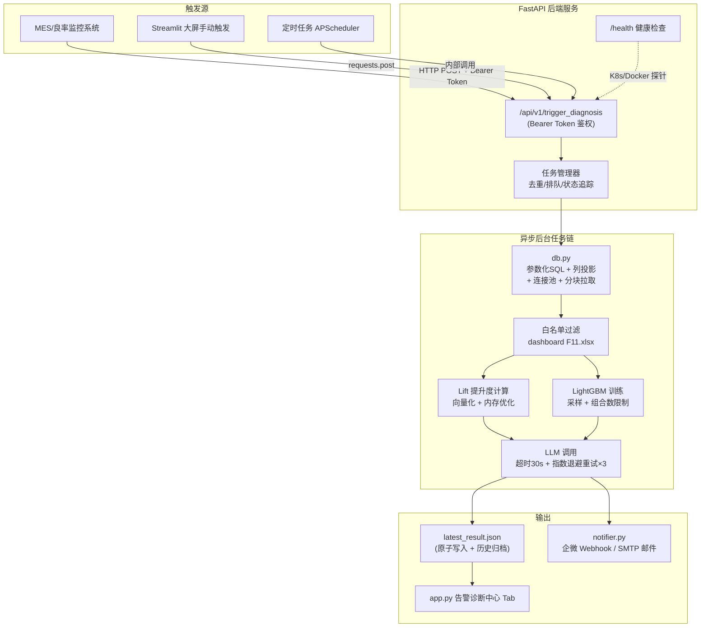

# 终检 Fail 共性聚集度分析系统 — 需求与改造方案设计书 V2

> **版本**: V2.0 — 企业级生产环境强化版  
> **更新日期**: 2026-05-27  
> **前置版本短板**: V1 方案忽视了 40 万行数据拉取时的内存/IO 瓶颈、SQL 注入安全漏洞、并发任务冲突、LLM 调用容错等生产环境关键细节。V2 针对这些问题逐一给出了企业级加固方案。

---

## 一、 原始需求与业务构想整理

### 1.1 背景与期望目标

目前，平台采用的是**单机交互式 Streamlit 应用**模式，需要用户手动上传 PRB 数据文件和配置参数，并等待前台串行计算。
为了提高质量管理的及时性与自动化水平，**老板的构想**是将其改造为**高内聚的后端服务**，建立起"产线异常告警 → 后端智能诊断 → 全渠道推送/大屏实时渲染"的自动化闭环。

### 1.2 核心业务点梳理

根据具体设想与老板的期望，本次改造包含以下五个核心诉求：

1. **后端服务化与接口触发**：
   * 采用后端服务架构，暴露标准 API。
   * 支持某种自动化触发方式（如 MES 告警、大数据平台 Webhook）。
   * 触发参数支持**带或不带 `failed_station`**：
     * 若带参数：针对特定故障工站进行精确定位分析；
     * 若不带参数：自动针对全量数据（全工站大盘）中所有过去一段时间的 Fail 样本进行共性聚集扫描。

2. **数据库直连拉取**：
   * 后端服务接收到触发消息或请求后，**直接前往数据库拉取数据**。
   * 数据拉取应针对**过去某一段时间内的所有数据**（如过去 24 小时、12 小时等），完全摆脱对外部手动上传数据文件（如 CSV、Excel 文件）的依赖。

3. **服务端特征白名单过滤**：
   * 考虑到工厂制程数据的复杂性和噪音，服务端需要**完整保留并使用 `dashboard F11.xlsx` 字典文件**中的特征列配置。
   * 只拉取和计算在字典第一列中登记过的特征列，自动剔除序列号、非分析时间戳等脏数据，实现业务层面的特征清洗与过滤。

4. **核心计算引擎（Lift & LightGBM）**：
   * 后端服务自动运行计算模块，包含两大核心计算分支：
     * **提升度算法（Lift）**：寻找单因子聚集异常；
     * **LightGBM 树模型分类器**：自动学习特征的重要程度（信息增益 Gain）并回溯扫描找出**多因子高危交叉致死规则**。

5. **全渠道多终端呈现**：
   * **前端大屏实时展现**：计算完毕后，数据和可视化图表需要完美展现到前端 Dashboard 界面上。
   * **智能诊断推送**：通过**企业微信（群机器人 Webhook）**或**邮件（SMTP）**将智能诊断报告推送给质量经理和现场排查人员。

---

## 二、 现有代码安全与性能审计

> 以下是对项目现有代码的逐模块深度审计，所有发现的问题将在第三章的改造方案中给出对应解法。

### 2.1 `db.py` — 严重问题 (3项)

| 编号 | 严重等级 | 问题描述 | 影响 |
|------|---------|---------|------|
| DB-1 | 🔴 **致命** | `fetch_recent_data()` 第 35-38 行使用 **f-string 拼接 SQL**（`WHERE Project = '{project}'`），存在 **SQL 注入漏洞** | 攻击者可通过 API 参数注入恶意 SQL，导致数据泄露或删库 |
| DB-2 | 🔴 **严重** | `SELECT *` 拉取全部列（生产表可能有 500+ 列），40 万行 × 500 列 ≈ **2~4 GB 内存**，单次查询耗时可达 30~90 秒 | 服务端 OOM 崩溃、数据库被慢查询拖垮 |
| DB-3 | 🟡 **中等** | `get_engine()` 每次调用都 `create_engine()` 创建新连接，无连接池复用 | 高并发下数据库连接数耗尽 |

**现有问题代码示例**：
```python
# db.py 第 35-38 行 — SQL 注入漏洞
query = f"""
    SELECT * FROM eol_data
    WHERE Project = '{project}'           # ← 直接拼接用户输入！
      AND Date >= NOW() - INTERVAL {hours} HOUR
"""
```

### 2.2 `engine.py` — 性能与鲁棒性问题 (4项)

| 编号 | 严重等级 | 问题描述 | 影响 |
|------|---------|---------|------|
| ENG-1 | 🟡 **中等** | `run_fused_diagnosis()` 第 242 行硬编码排除列，未读取 `dashboard F11.xlsx` 白名单 | 无法精准控制参与计算的特征列，可能引入大量噪音列 |
| ENG-2 | 🟡 **中等** | `run_ml_diagnosis_engine()` 第 102 行 `pd.concat([df_base, df_fail])` 在 40 万行场景下会产生整个 DataFrame 的完整拷贝 | 内存峰值翻倍（40万行 × 2 ≈ 80万行临时对象） |
| ENG-3 | 🟡 **中等** | 多因子组合挖掘的 `itertools.combinations` 在 Top 8 特征做 4 维组合时，产生 C(8,4) = 70 个组合，每组都要做 `groupby`，40万行下耗时较大 | 组合爆炸导致计算超时 |
| ENG-4 | 🟢 **低** | LLM 调用无超时设置、无重试机制 | 网络抖动时整个后台任务链中断 |

### 2.3 `server.py` — 企业级缺陷 (5项)

| 编号 | 严重等级 | 问题描述 | 影响 |
|------|---------|---------|------|
| SRV-1 | 🔴 **严重** | API 接口无任何鉴权机制（无 API Key、无 Token） | 任何人可以向接口发请求触发分析，消耗服务器资源 |
| SRV-2 | 🟡 **中等** | `failed_station` 是必填字段，不支持"全局大盘分析"模式 | 不满足"不带 failed_station 参数"的需求 |
| SRV-3 | 🟡 **中等** | 后台任务是 fire-and-forget，无法查询任务状态、无法知道计算进度 | 调用方无法知道分析是否完成、是否报错 |
| SRV-4 | 🟡 **中等** | 没有并发防重机制，连续 N 次请求会触发 N 个相同的后台任务 | 数据库和 LLM 被重复调用，资源浪费 |
| SRV-5 | 🟢 **低** | 缺少 `/health` 健康检查端点 | 无法用于 K8s/Docker 存活探针 |

### 2.4 `app.py` — 与后端服务联动缺失

| 编号 | 严重等级 | 问题描述 | 影响 |
|------|---------|---------|------|
| APP-1 | 🟡 **中等** | 当前 app.py 的 Lift 计算引擎与 engine.py 中的引擎是**两套独立实现**，逻辑存在细微差异（如 `fail_one_results` 检测、`ratio_results` 处理等） | 前台手动分析与后台 API 触发分析的结果可能不一致 |
| APP-2 | 🟡 **中等** | 没有"实时监控大屏"Tab 来展示后端服务的历史和最新诊断报告 | 后端服务计算完成后，前端无法感知 |

---

## 三、 升级改造方案系统架构设计

### 3.1 整体技术架构图



### 3.2 各问题对应解决方案速查表

| 问题编号 | 解决方案 | 详见章节 |
|---------|---------|---------|
| DB-1 (SQL注入) | 改用 SQLAlchemy `text()` + 参数绑定 `:param` | §3.3.1 |
| DB-2 (SELECT *) | SQL 中指定白名单列名 (`SELECT col1, col2, ...`)，数据库端完成列投影 | §3.3.1 |
| DB-3 (无连接池) | 全局单例 Engine + `pool_size=5, max_overflow=10` | §3.3.1 |
| ENG-1 (未用白名单) | `engine.py` 启动时加载 `dashboard F11.xlsx` 提取白名单 | §3.3.2 |
| ENG-2 (内存翻倍) | 统一标签列代替 concat，或使用 `pd.Categorical` 压缩内存 | §3.3.3 |
| ENG-3 (组合爆炸) | 限制 Top 5 特征 + 最高 3 维组合 + 提前剪枝 | §3.3.3 |
| ENG-4 (LLM无容错) | `timeout=30` + `tenacity` 指数退避重试 3 次 | §3.3.4 |
| SRV-1 (无鉴权) | FastAPI `Depends` + Bearer Token 校验 | §3.3.5 |
| SRV-2 (station必填) | `failed_station: Optional[str] = None` | §3.3.5 |
| SRV-3 (无状态追踪) | 内存任务字典 + `/api/v1/task/{task_id}` 查询端点 | §3.3.5 |
| SRV-4 (无防重) | 基于 `(project, station, hours_back)` 的去重锁 | §3.3.5 |
| SRV-5 (无健康检查) | `GET /health` 返回服务状态 | §3.3.5 |
| APP-1 (双引擎不一致) | 前端 Streamlit 的 Lift 计算改为调用 `engine.py` 的统一函数 | §3.3.6 |
| APP-2 (无监控大屏) | 新增「🔔 告警诊断中心」Tab，自动加载 `latest_result.json` | §3.3.6 |

---

### 3.3 各模块详细改造方案

#### 3.3.1 数据库模块 `db.py` — 安全与性能加固

**SQL 注入修复**：使用 SQLAlchemy 参数化查询，彻底杜绝注入风险：
```python
from sqlalchemy import text

def fetch_recent_data(project: str, station: str, hours: int, columns: List[str]):
    # 列名白名单校验（防止列名注入）
    safe_columns = [c for c in columns if re.match(r'^[A-Za-z_][A-Za-z0-9_]*$', c)]
    col_clause = ", ".join(f"`{c}`" for c in safe_columns)
    
    sql = text(f"""
        SELECT {col_clause}
        FROM eol_data
        WHERE Project = :project
          AND Date >= NOW() - INTERVAL :hours HOUR
    """)
    
    with engine.connect() as conn:
        df = pd.read_sql(sql, conn, params={"project": project, "hours": hours})
    return df
```

**40 万行数据性能优化策略**：

| 优化手段 | 具体做法 | 预期效果 |
|---------|---------|---------|
| **列投影下推** | SQL 中只 SELECT 白名单列（约 200 列而非 500+），在数据库端完成列裁剪 | 网络传输量减少 50%+，内存占用减半 |
| **数据类型优化** | 拉取后对低基数列（如机台 ID、批次号）使用 `pd.Categorical` | 内存降低 60~80% |
| **连接池复用** | 全局单例 Engine，配置 `pool_size=5, max_overflow=10, pool_recycle=3600` | 避免连接数泄漏 |
| **分块拉取 (可选)** | 数据量超过 50 万行时启用 `chunksize=100000` 分块读取并逐块合并 | 避免单次加载 OOM |

**内存估算**（40 万行场景）：
```
原方案 SELECT * (500 列):  ~400,000 × 500 × 50 bytes ≈ 9.3 GB   ← 极易 OOM
列投影后 (200 列):          ~400,000 × 200 × 50 bytes ≈ 3.7 GB
+ pd.Categorical 优化后:    ~400,000 × 200 × 8 bytes  ≈ 610 MB   ← 可控
```

#### 3.3.2 特征白名单加载

在 `engine.py` 中新增启动级白名单加载函数，确保只使用受控特征：
```python
import functools

@functools.lru_cache(maxsize=1)
def load_dashboard_whitelist(dashboard_path: str) -> Tuple[List[str], Dict[str, str]]:
    """从 dashboard F11.xlsx 读取特征列白名单和含义映射"""
    df_dict = pd.read_excel(dashboard_path)
    col_names = df_dict.iloc[:, 0].dropna().tolist()
    desc_map = {}
    for _, row in df_dict.iterrows():
        col = str(row.iloc[0]).strip() if pd.notna(row.iloc[0]) else None
        desc = str(row.iloc[3]).strip() if pd.notna(row.iloc[3]) else None
        if col and desc:
            desc_map[col] = desc
    return col_names, desc_map
```

在 `run_fused_diagnosis()` 的入口处，使用白名单过滤替代现有的硬编码排除：
```python
whitelist_cols, desc_map = load_dashboard_whitelist(DASHBOARD_PATH)
all_feature_cols = [c for c in whitelist_cols if c in df_raw.columns and c not in SKIP_COLS]
```

#### 3.3.3 计算引擎性能优化 — 40 万行专项

**Lift 计算优化**：
```python
# 原方案：逐列 Python for-loop，40万行 × 200列 ≈ 耗时较长
# 优化方案：利用 pandas 向量化 + 提前跳过空列
def compute_lift_optimized(df_base, df_fail, feature_cols):
    # 1. 提前计算所有列的 nunique，一次性过滤
    nunique_base = df_base[feature_cols].nunique()
    valid_cols = nunique_base[(nunique_base > 1) & (nunique_base <= max_unique)].index.tolist()
    
    # 2. 对每个有效列，使用向量化 value_counts（已有）
    # 3. 跳过空列的判断提前到循环外批量完成
    ...
```

**LightGBM 内存优化**：
```python
# 原方案：pd.concat 复制 40 万行数据
# 优化方案：原地打标签，避免内存翻倍
df_raw["_label"] = (df_raw["Results"] == "FAIL").astype(int)
y = df_raw["_label"]
X = df_raw[features_to_use].copy()  # 只拷贝特征列，不拷贝全量
```

**组合爆炸控制**：
```python
# 原方案：Top 8 特征，4 维组合 → C(8,2)+C(8,3)+C(8,4) = 28+56+70 = 154 种
# 优化方案：收紧到 Top 5 特征，最高 3 维 → C(5,2)+C(5,3) = 10+10 = 20 种
TOP_FEATURES_FOR_COMBO = 5  # 减少参与组合的特征数
MAX_COMBO_DIM = 3           # 最高 3 维组合
# 额外优化：在 groupby 前先判断该组合是否在 fail 中有足够样本
```

#### 3.3.4 LLM 调用容错

```python
from tenacity import retry, stop_after_attempt, wait_exponential

@retry(
    stop=stop_after_attempt(3),
    wait=wait_exponential(multiplier=1, min=2, max=15),
    reraise=True
)
def call_llm_with_retry(api_key, api_base, model, prompt):
    response = requests.post(
        f"{api_base.rstrip('/')}/chat/completions",
        headers={"Authorization": f"Bearer {api_key}", ...},
        json={...},
        timeout=30  # ← 添加超时
    )
    response.raise_for_status()  # 非 2xx 自动抛异常触发重试
    return response.json()["choices"][0]["message"]["content"]
```

#### 3.3.5 后端服务 `server.py` — 企业级加固

**API 鉴权**：
```python
from fastapi import Depends, Header

async def verify_token(authorization: str = Header(...)):
    expected = os.getenv("API_BEARER_TOKEN", "")
    if not expected or authorization != f"Bearer {expected}":
        raise HTTPException(status_code=401, detail="无效的访问令牌")

@app.post("/api/v1/trigger_diagnosis", dependencies=[Depends(verify_token)])
async def trigger_diagnosis(req: AnomalyTriggerRequest, ...):
    ...
```

**请求体增强** — `failed_station` 改为可选：
```python
class AnomalyTriggerRequest(BaseModel):
    project: str
    failed_station: Optional[str] = None  # ← 可选，为空时分析全局大盘
    hours_back: int = 24
    send_qywx: bool = True
    send_email: bool = False
```

**任务去重与状态追踪**：
```python
import threading

# 全局任务注册表
_task_registry: Dict[str, Dict] = {}
_task_lock = threading.Lock()

def _make_dedup_key(req: AnomalyTriggerRequest) -> str:
    """基于请求参数生成去重键"""
    return f"{req.project}_{req.failed_station or 'ALL'}_{req.hours_back}"

@app.post("/api/v1/trigger_diagnosis")
async def trigger_diagnosis(req, background_tasks):
    dedup_key = _make_dedup_key(req)
    
    with _task_lock:
        if dedup_key in _task_registry and _task_registry[dedup_key]["status"] == "running":
            return {"status": "duplicate", "message": "相同参数的分析任务正在进行中", 
                    "task_id": _task_registry[dedup_key]["task_id"]}
        
        task_id = "T" + os.urandom(4).hex()
        _task_registry[dedup_key] = {"task_id": task_id, "status": "running", "started_at": ...}
    
    background_tasks.add_task(process_anomaly_background, req, task_id, dedup_key)
    return {"status": "accepted", "task_id": task_id}

@app.get("/api/v1/task/{task_id}")
async def get_task_status(task_id: str):
    """查询任务状态"""
    for key, info in _task_registry.items():
        if info["task_id"] == task_id:
            return info
    raise HTTPException(status_code=404, detail="任务不存在")

@app.get("/health")
async def health_check():
    return {"status": "ok", "active_tasks": sum(1 for t in _task_registry.values() if t["status"] == "running")}
```

**结果持久化 — 原子写入 + 历史归档**：
```python
import tempfile, shutil

def save_result_atomic(result: dict, base_dir: str):
    """原子写入，防止并发写入导致 JSON 损坏"""
    result_path = os.path.join(base_dir, "latest_result.json")
    
    # 1. 先写临时文件
    fd, tmp_path = tempfile.mkstemp(dir=base_dir, suffix=".json.tmp")
    try:
        with os.fdopen(fd, "w", encoding="utf-8") as f:
            json.dump(result, f, ensure_ascii=False, indent=2, default=str)
        # 2. 原子重命名（同文件系统上是原子操作）
        shutil.move(tmp_path, result_path)
    except:
        os.unlink(tmp_path)
        raise
    
    # 3. 同步归档一份到 history/ 目录（按时间戳命名）
    history_dir = os.path.join(base_dir, "history")
    os.makedirs(history_dir, exist_ok=True)
    ts = datetime.now().strftime("%Y%m%d_%H%M%S")
    shutil.copy2(result_path, os.path.join(history_dir, f"result_{ts}.json"))
```

#### 3.3.6 前端 `app.py` — 统一引擎 + 监控大屏

**统一计算引擎**：将 `app.py` 中 ~140 行的 `compute_lift()` 逻辑抽取到 `engine.py`，前端只负责调用和渲染。避免两套引擎产生不一致的分析结果。

**新增「🔔 告警诊断中心」Tab**：
```python
# 在现有 5 个 Tab 之前插入一个监控大屏 Tab
tab_monitor, tab1, tab2, tab3, tab4, tab5 = st.tabs([
    "🔔 告警诊断中心",       # ← 新增
    "📈 共性聚集度排行榜(Lift)",
    "📉 Fail内占比排行榜",
    "🔍 单因子 Pass/Fail 对比",
    "⏰ 时间小时聚集度(Hour)",
    "🤖 AI 根因诊断 (LightGBM)",
])

with tab_monitor:
    # 1. 自动加载 latest_result.json（如果存在）
    result_path = os.path.join(os.path.dirname(__file__), "latest_result.json")
    if os.path.exists(result_path):
        with open(result_path, "r", encoding="utf-8") as f:
            latest = json.load(f)
        # 2. 渲染指标卡、Lift 排行图、LLM 报告等
        ...
    else:
        st.info("暂无后端诊断记录。")
    
    # 3. 手动触发按钮
    if st.button("🚀 立即触发实时诊断"):
        requests.post("http://localhost:8000/api/v1/trigger_diagnosis", ...)
        st.info("已触发后台分析，请稍候刷新页面...")
```

---

## 四、 推送服务设计 (`notifier.py`)

### 4.1 企业微信 Webhook 推送

```python
def send_qywx_webhook(webhook_url: str, report: str, project: str, station: str):
    """发送企业微信 Markdown 消息"""
    # 企微 Markdown 有 4096 字符限制，需要截断
    content = report[:3800] if len(report) > 3800 else report
    
    payload = {
        "msgtype": "markdown",
        "markdown": {
            "content": f"## 🚨 【{project}】良率告警诊断报告\n"
                       f"> 故障工站: **{station or '全局大盘'}**\n\n"
                       f"{content}"
        }
    }
    response = requests.post(webhook_url, json=payload, timeout=10)
    return response.status_code == 200
```

### 4.2 SMTP 邮件推送

使用 HTML 模板渲染数据表格和大模型报告，通过 `smtplib` + `email.mime` 发送。

### 4.3 推送配置（`.env` 文件新增项）

```ini
# 企业微信群机器人 Webhook
QYWX_WEBHOOK_URL=https://qyapi.weixin.qq.com/cgi-bin/webhook/send?key=YOUR_KEY

# SMTP 邮件配置
SMTP_HOST=smtp.company.com
SMTP_PORT=465
SMTP_USER=alert@company.com
SMTP_PASS=your_password
SMTP_RECIPIENTS=manager@company.com,engineer@company.com
```

---

## 五、 完整数据流交互时序

```
                    调用方                    FastAPI                     后台任务链                    前端大屏
                      │                         │                           │                           │
                      │── POST /trigger ───────>│                           │                           │
                      │                         │── 鉴权 + 去重检查 ──────>│                           │
                      │<── 200 {task_id} ───────│                           │                           │
                      │                         │                           │                           │
                      │                         │       ┌──── db.py ────────┤                           │
                      │                         │       │ 参数化 SQL        │                           │
                      │                         │       │ 列投影(200列)     │                           │
                      │                         │       │ 连接池复用        │                           │
                      │                         │       └──────────────────>│                           │
                      │                         │                           │                           │
                      │                         │       ┌── engine.py ──────┤                           │
                      │                         │       │ 白名单过滤        │                           │
                      │                         │       │ Lift 向量化计算   │                           │
                      │                         │       │ LightGBM 训练     │                           │
                      │                         │       │ 组合规则挖掘      │                           │
                      │                         │       └──────────────────>│                           │
                      │                         │                           │                           │
                      │                         │       ┌── LLM 调用 ──────┤                           │
                      │                         │       │ 30s超时+3次重试   │                           │
                      │                         │       └──────────────────>│                           │
                      │                         │                           │                           │
                      │                         │       ┌── 输出 ──────────┤                           │
                      │                         │       │ 原子写JSON       │── latest_result.json ────>│
                      │                         │       │ 企微推送          │                           │
                      │                         │       │ 邮件推送          │                           │
                      │                         │       │ 更新任务状态      │                           │
                      │                         │       └──────────────────>│                           │
                      │                         │                           │                           │
                      │── GET /task/{id} ──────>│                           │                           │
                      │<── {status: success} ───│                           │                           │
```

---

## 六、 文件改动总览

| 文件 | 操作 | 改动要点 |
|------|------|---------|
| `db.py` | **修改** | 参数化 SQL、列投影、全局连接池、分块拉取、`pd.Categorical` 内存优化 |
| `engine.py` | **修改** | 加载白名单、统一 Lift 引擎（从 app.py 迁入）、LGB 内存优化、组合维度限制、LLM 重试 |
| `server.py` | **修改** | Bearer Token 鉴权、station 可选、任务去重/状态追踪、健康检查端点、原子 JSON 持久化 |
| `notifier.py` | **新增** | 企微 Webhook 推送、SMTP 邮件推送 |
| `app.py` | **修改** | 新增「告警诊断中心」Tab、Lift 计算改用统一引擎、手动触发按钮 |
| `.env` | **修改** | 新增 `API_BEARER_TOKEN`、`QYWX_WEBHOOK_URL`、SMTP 相关配置项 |
| `requirements.txt` | **修改** | 新增 `fastapi`, `uvicorn`, `tenacity`, `lightgbm`, `sqlalchemy`, `pymysql` |

---

## 七、 验证计划

### 7.1 安全验证
- 构造含 `'; DROP TABLE --` 的 project 参数调用 API，验证参数化查询是否防住注入
- 不带 Bearer Token 调用 API，验证返回 401

### 7.2 性能验证
- 使用 Mock 40 万行数据，测量端到端耗时（目标：<60 秒完成全链路）
- 监控内存峰值（目标：< 2 GB）

### 7.3 功能验证
- 不带 `failed_station` 触发分析，验证全局大盘模式
- 带 `failed_station` 触发，验证工站定向模式
- 连续发送 3 次相同请求，验证去重机制
- 查询 `/api/v1/task/{task_id}`，验证状态追踪
- 检查企微群和邮箱是否收到格式正确的推送
